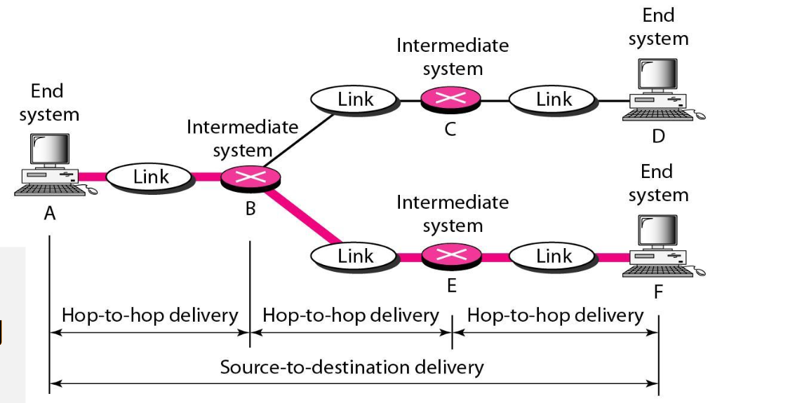
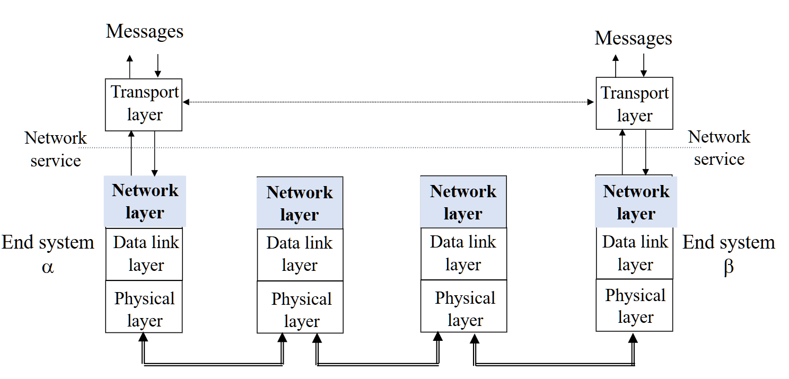
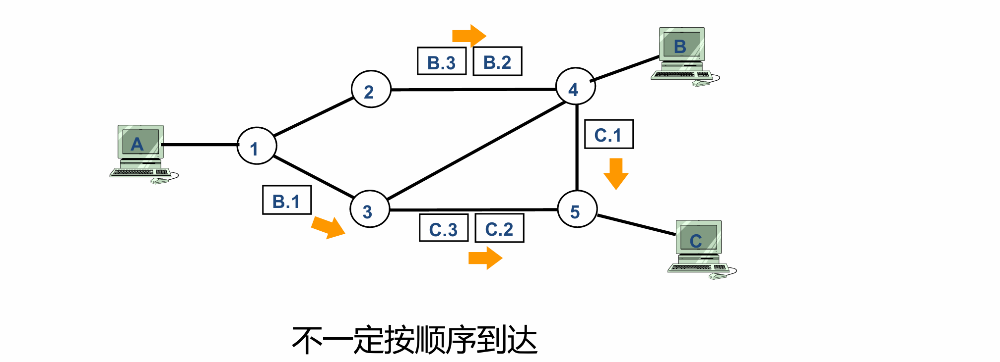
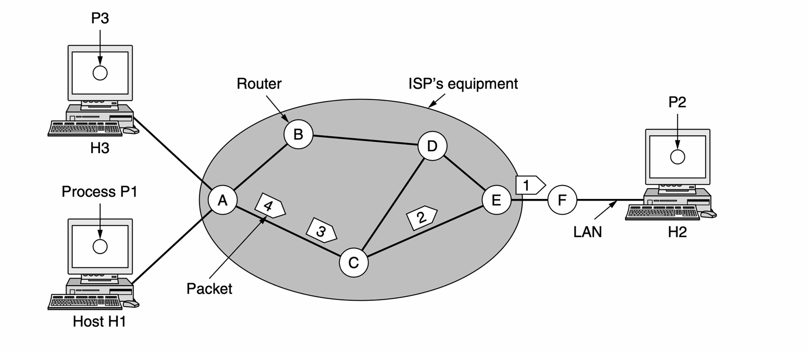
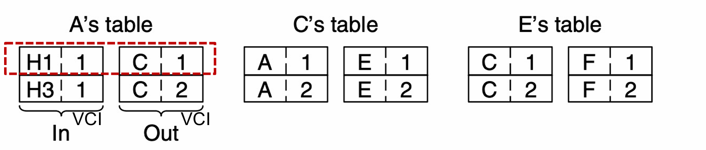
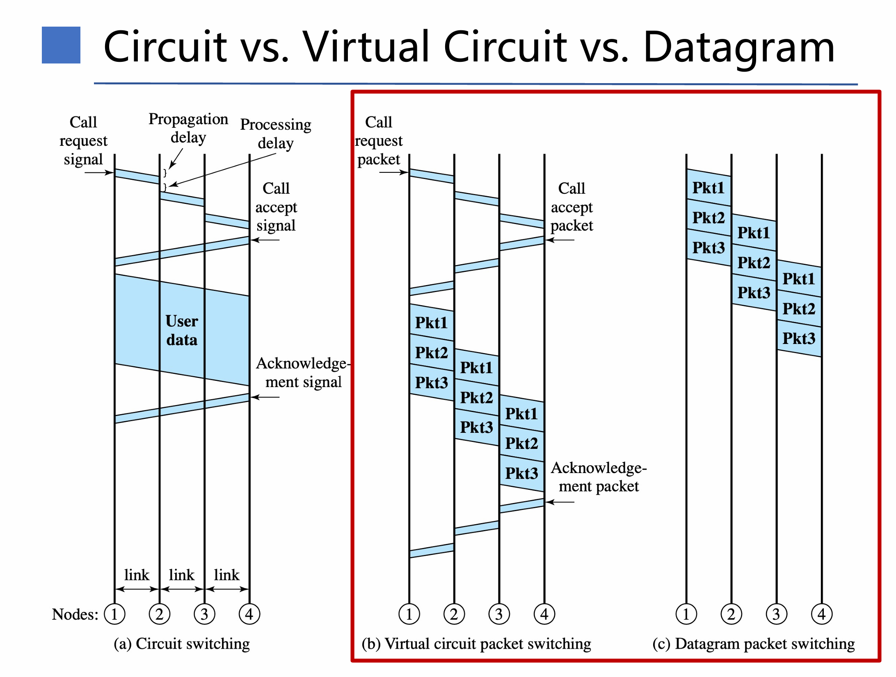
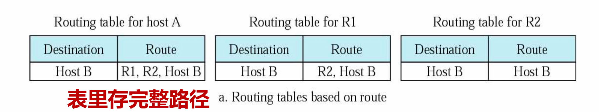
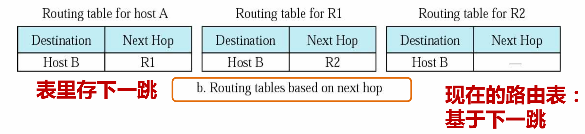
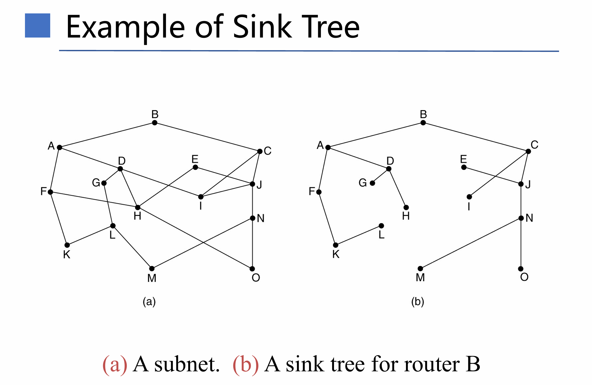

# 每日一言

什么都无法舍弃的人，什么也改变不了。

——《进击的巨人》

<!-- more -->

# Network Layer Introduce

## Overview

Hop-to-hop : 点到点，相邻两个设备之间的通信，一般是主机与路由，路由与路由之间。

end-to-end：端到端，主机到主机之间的通信，忽略中间的路由。

Network layer is the lowest layer that deals with **end-to-end transmission (网络层是端到端传输的最底层)**

* 数据链路层只负责**点到点之间**的传输。

## Design Issues

* Network layer must know about topology
* Choose **appropriate** paths and avoiding **overloading**
* The source and destination are in different networks

### Network Layer Functions

* Interconnecting 网络互联

  * Different networks and making them look the same to the transport layer
  * 传输层无需关心低层的物理网络即可发送信息
* Addressing 编址

  * The addresses of a host/router must be uniquely(唯一) and universally(规则统一)
* Packetizing 形成数据包

  * Encapsulated(封装) message received from upper layer
* Fragmenting 分片

  * The network layer must be able to operate on top of any data-link layer technology
  * 网络层必须能够在任何数据链路层之上运行
  * The network layer must be able to fragment transport layer **PDUs(协议数据单元)** into smaller units so that they can be **transferred(转移)** over various data-link layer technologies.
* **Routing 路由 (核心功能)**

  * Making the decision which routes to use
  * Filling in and updating the routing tables

### Services Provided to Transport Layer

设计目标：

* 服务应该独立于路由技术。(降低对于特定路由的依赖，得以在任何路由网络中工作)
* 向Transport layer 隐藏路由器的数量，类型和拓扑关系。
* 传输层使用的网络应该有统一的编址方案

分类：两种都是分组交换

Connection-Oriented Service：Virtual Circuit 虚电路

Connectionless Service：Datagram 数据报

# Datagram 数据报

无连接的，尽最大努力交付

# Virtual Circuit 虚电路

建立一条逻辑上的连接，分组都沿着这条逻辑连接按照存储转发的方式传送，而并不是真正建立了一条物理连接。

* VCI：Virtual Circuit Identifier 虚拟电路号

当不同接口收到同一个VCI时，接收路由应该区分它们，否则后续路由都将无法区分。

| 问题           | 数据报子网                           | 虚电路子网                                   |
| -------------- | ------------------------------------ | -------------------------------------------- |
| 电路设置       | 不需要                               | 需要                                         |
| 编址           | 每个分组包含完整的源地址和目的地址   | 每个分组包含一个短的虚电路号                 |
| 状态信息       | 路由器不持有关于连接的状态信息       | 每条虚电路在路由器中需要占用表空间           |
| 路由选择       | 每个分组独立路由                     | 虚电路建立时选定路由，所有分组都沿此路由传输 |
| 路由器故障影响 | 除了故障期间丢失的分组外，无其他影响 | 经过故障路由器的所有虚电路都终止             |
| 服务质量       | 困难                                 | 如果能为每条虚电路预先分配足够资源则容易     |
| 拥塞控制       | 困难                                 | 如果能为每条虚电路预先分配足够资源则容易     |

虚拟电路依然是分组传送，只不过拥有相同VIC的数据报会沿着相同的路径进行传输，仿佛在一条电路上。

# Routing Algorithms

Routing Algorithms：用于构造和更新路由表算法

Routing Protocolls：路由协议是一组规则和程序，当网络拓扑等发生变化时，路由器可借助它相互通告信息。它主要依靠不同网络中的路由器之间共享、整合信息，从而让路由器知晓网络的最新状态，以便正确地转发数据包。

Routing table ：

* 表里存完整路径：
* 表里存下一跳：

  

## Routing

定义：决定定义的数据包应该从哪条线路传输

* 数据报Datagrams：对于每个数据包都选择最佳的传输路径，每个数据包都单独决策
* 虚电路Virtual circuits：仅在建立新虚电路时进行路由决策，后续数据包遵循先前建立好的路由。

## Classification of Routing Algorithms

* Nonadaptive algorithms(Static Routing) 非自适应路由
  * 路由决策不基于对当前流量和拓扑结构的测量或估计。
  * 路由选择是提前离线计算好的，在启动时下载到路由器中。
* Adaptive algorithms 自适应路由
  * 会根据网络拓扑结构的变化，流量的变化，动态的改变路由决策。

### 最优化原则(The Optimality Principle)

如果路由器 J 在路由器 I 到路由器 K 的最优路径上，那么从 J 到 K 的最优路径也在同一条路线上。

### Sink Tree

汇集树（Sink Tree）是指**所有源节**点到**一个指定目标节点**的最优路径的集合 ，它构成一棵**以目标节点为根**的树。在网络拓扑中，从各个不同的源点出发，寻找通往特定目的节点的最佳路由，这些最佳路由组合起来就呈现出树状结构，目的节点作为树根。

特点：

* 汇集树不包含任何回路（loops），有回路意味着会陷入无尽循环

