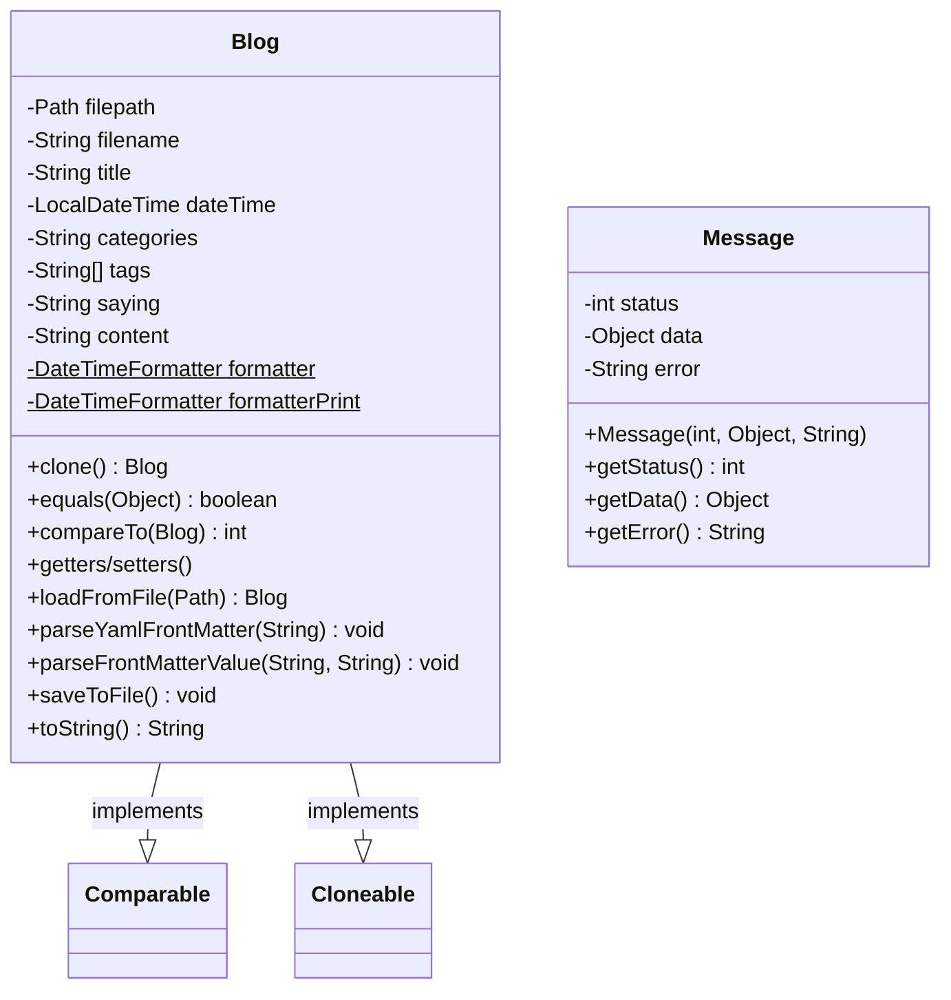
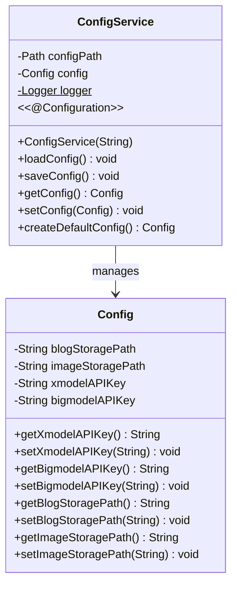
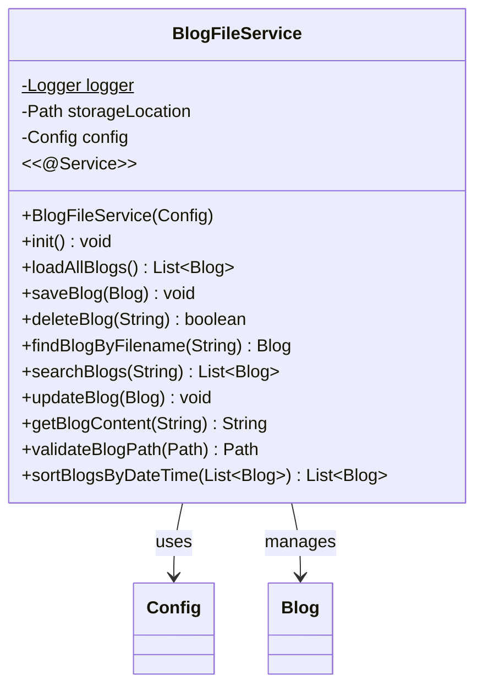
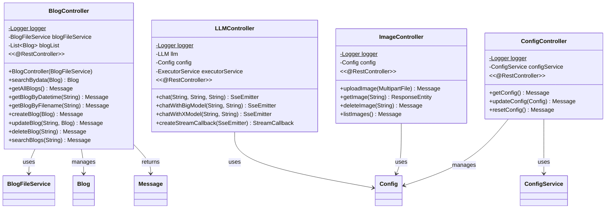
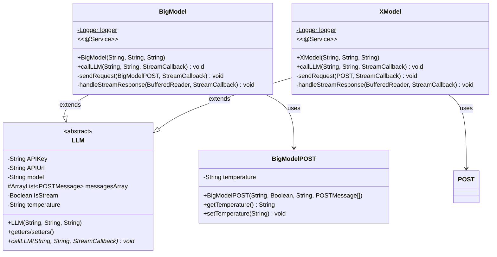
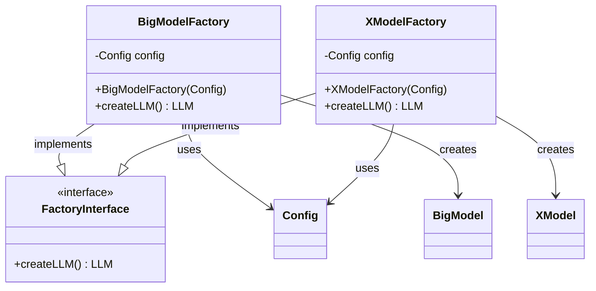
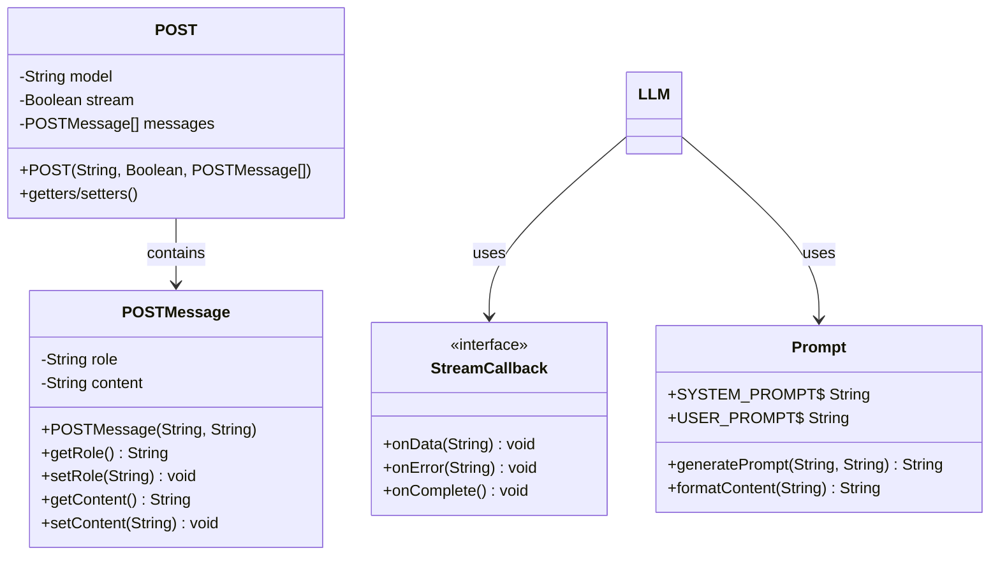
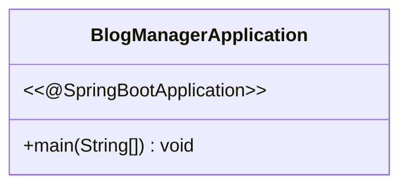
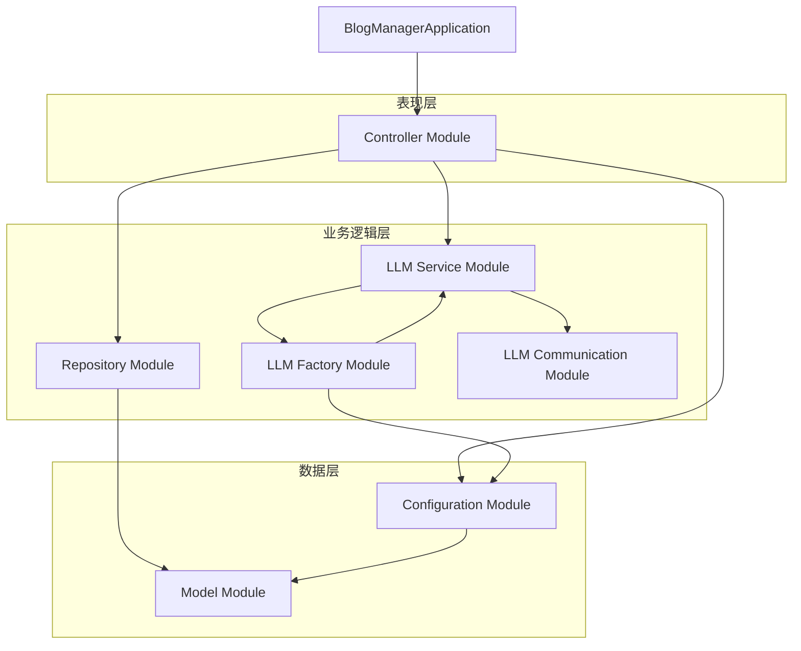

# 博客管理系统 - 模块类图

## 1. 核心数据模型模块 (Model Module)

## 2. 配置管理模块 (Configuration Module)

## 3. 数据访问层模块 (Repository Module)

## 4. 控制器层模块 (Controller Module)

## 5. LLM服务模块 (LLM Service Module)

## 6. LLM工厂模式模块 (LLM Factory Module)

## 7. LLM通信模块 (LLM Communication Module)

## 8. 主应用程序模块 (Main Application Module)

## 模块间依赖关系图

## 关键设计模式

1. **工厂模式**: `FactoryInterface`, `BigModelFactory`, `XModelFactory`
2. **模板方法模式**: `LLM`抽象类
3. **回调模式**: `StreamCallback`接口
4. **依赖注入**: Spring框架的 `@Autowired`注解
5. **MVC模式**: Controller-Service-Repository架构
