# 系统概述

## 项目背景

该博客管理系统是一个基于**Spring Boot 3.4.5**构建的后端API服务，采用标准的MVC架构模式，提供完整的博客文章管理功能，包括文章的增删改查、图片管理、配置管理以及LLM（大语言模型）集成等功能。

## 技术栈

Spring Boot 3.4.5、Java 17、Spring Web、Spring WebFlux、SnakeYAML、Gson、Maven

## 系统特点

* **RESTful API设计** ：遵循REST架构风格，提供标准化的HTTP接口
* **文件存储** ：采用本地文件系统存储，支持Markdown格式文章
* **配置管理** ：支持动态配置加载和更新
* **LLM集成** ：集成多种大语言模型API，支持智能内容生成
* **流式响应** ：支持Server-Sent Events(SSE)实现实时数据推送

# 系统架构分析

## Maven构建工具

Maven 是一个 **基于 POM（Project Object Model）** 的构建工具，它通过一个 `pom.xml` 文件来管理项目的配置，包括依赖、插件、构建流程等。本项目使用maven作为构建工具，简化环境配置，依赖注入，项目打包等流程。

Maven的作用包括以下几点：

* **依赖管理** ：自动下载并管理项目所需的第三方库（如JUnit,Spring,MySQL驱动），避免手动引入jar包。
* Jar包：用于打包Java类、资源文件和元数据的压缩文件格式。
* **标准化项目结构** ：Maven 提倡统一的项目目录结构，关于具体的结构我们下面再讲。
* **构建自动化** ：一条命令即可完成编译、测试、打包、安装、部署等流程。
* **插件机制** ：支持丰富的插件。

## MVC软件架构模式

**MVC模式**(Model-View-Controller)是一种软件架构模式，被广泛应用于Web开发和桌面应用开发中。它通过将应用程序分为三部分，使得代码结构清晰，易于维护和扩展。本项目使用Spring，SpringMVC、SpringBoot框架进行项目后端开发，使用Vue3框架进行前端开发。API接口遵循**RESTful API**设计规范。

系统架构总览：

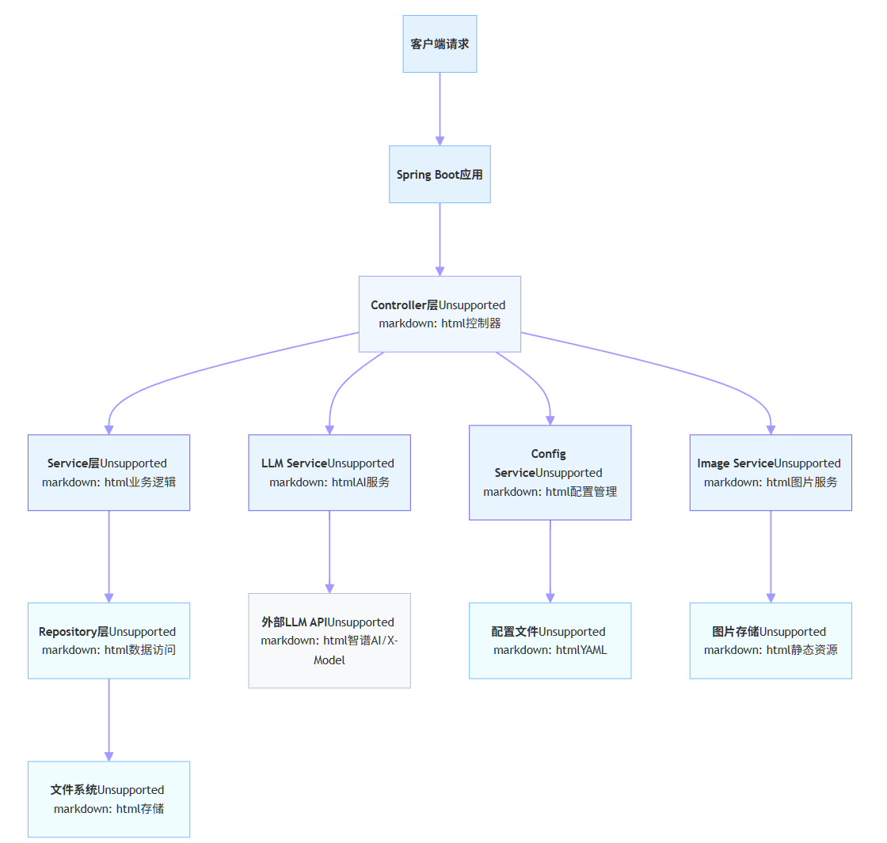

## Spring 分层架构

Spring中，每一层的作用是为了实现应用的分层架构，遵循单一职责原则，使代码更易于维护、测试和扩展。以下是各层的作用说明以及如何组织代码的说明。

### 启动类(BlogManagerApplication)

作用：

* 项目的入口，负责启动SpringBoot应用。
* 初始化Spring容器，并加载所有的配置和Bean。

> Bean 是由 Spring 容器管理的对象，用于实现依赖注入和组件化管理，是应用程序的核心构建模块。

### 控制器层(Controller)

作用：

* 接收用户的HTTP请求并返回响应。
* 处理请求参数和调用服务层。
* 是应用程序的入口点，负责将用户输入传递给服务层。
* 使用 `@RestController` 返回Json，或 `@Controller`返回视图。

> **职责** ：处理HTTP请求，参数验证，响应格式化
>
> **组件** ：BlogController, ConfigController, ImageController, LLMController
>
> **特点** ：采用@RestController注解，支持RESTful API设计，统一返回Message对象

### 服务层(Service)

作用：

* 封装业务逻辑
* 调用数据访问层处理数据，并将结果返回给Controller。
* 是业务规则实现的核心，独立于控制器和数据访问层。

> **职责** ：业务逻辑处理，事务管理，业务规则实现
>
> **组件** ：ConfigService, LLM相关服务
>
> **特点** ：使用@Service注解，实现具体业务逻辑

### 数据访问层(Respository)

作用：

* 负责与数据库交互，执行**CRUD**操作。
* 使用Spring Data JPA 或其他持久化工具
* 数据访问层只关心数据的存储和检索，不关心其他业务逻辑。

> * CRUD：即创建(Create)、读取(Read)、更新(Update)、删除(Delete)。
> * 持久化：将应用程序对象的状态保存到数据库的过程。

### 实体类(Model)

作用：

* 定义数据库表对应的实体
* 用于封装数据(通常是业务数据)
* 使用JPA注解(如 `@Entity`，`@Id`，`@Column`)定义实体和数据库表的映射关系。

> **组件**：Blog.java、Message.java

# 设计模式分析

## MVC(Model-View-Controller)模式

博客管理系统严格遵循Spring Boot的MVC架构模式，将应用程序分为三个核心组件：

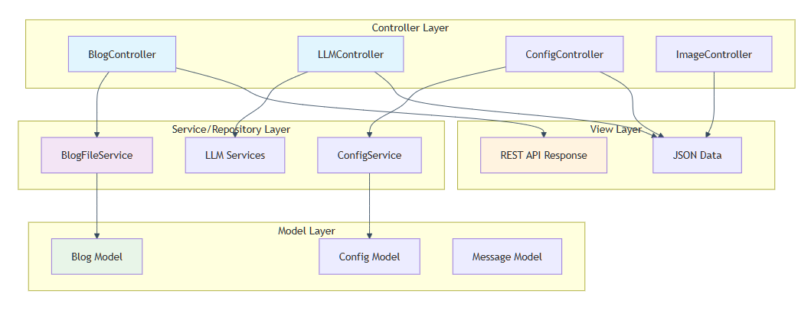

```java
Controller 层示例 (BlogController.java):
@RestController
@RequestMapping("/api/blogs")
public class BlogController {
    @Autowired
    private BlogFileService blogFileService;

    @GetMapping("/lists")
    public Message listBlogFilenames() {
        // 调用Service层处理业务逻辑
        this.blogList = blogFileService.listPostFilenames();
        return new Message(0, blogList, null);
    }
}
```

#### ✅ 优势

* **关注点分离** ：业务逻辑、数据模型和表示层完全解耦
* **可维护性** ：修改某一层不会影响其他层的实现
* **可测试性** ：每层都可以独立进行单元测试
* **团队协作** ：前后端开发人员可以并行工作
* **代码复用** ：Service层可以被多个Controller复用

#### 🔧 特点

* **单一职责** ：每个组件只负责自己的核心功能
* **松耦合** ：通过依赖注入实现组件间的松耦合
* **层次清晰** ：明确的分层结构便于理解和维护
* **RESTful设计** ：Controller提供标准的REST API接口

#### 🎯 解决的问题

* **代码混乱** ：避免将业务逻辑、数据访问和视图渲染混在一起
* **难以维护** ：通过分层降低系统复杂度
* **代码重复** ：Service层复用避免重复的业务逻辑
* **测试困难** ：分层设计使得单元测试更容易进行

## 工厂模式(Factory Pattern)

系统使用工厂模式来创建不同类型的LLM (Large Language Model) 实例，支持XModel和BigModel两种不同的AI服务提供商：

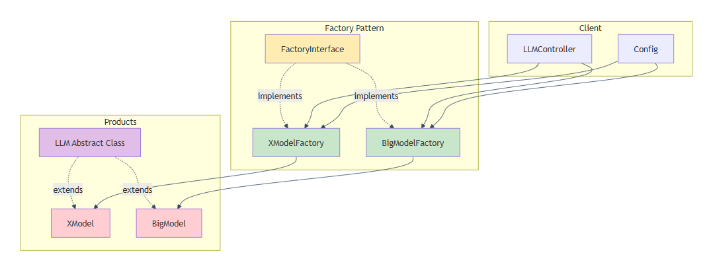

```java
工厂接口定义 (FactoryInterface.java):
public interface FactoryInterface {
    LLM createLLM();
}

具体工厂实现 (BigModelFactory.java):
public class BigModelFactory implements FactoryInterface {
    private String APIKey;
    private final String APIUrl = "https://open.bigmodel.cn/api/paas/v4/chat/completions";

    public BigModelFactory(Config config) {
        this.APIKey = config.getBigmodelAPIKey();
    }

    @Override
    public LLM createLLM() {
        return new BigModel(APIKey, APIUrl, model);
    }
}
```

#### ✅ 优势

* **扩展性** ：添加新的LLM提供商只需新增工厂类，无需修改现有代码
* **封装创建逻辑** ：隐藏复杂的对象创建过程和参数配置
* **统一接口** ：客户端通过统一的接口获取不同类型的LLM实例
* **降低耦合** ：客户端代码不直接依赖具体的LLM实现类

#### 🔧 特点

* **多态性** ：基于接口的设计支持运行时切换不同的工厂
* **配置驱动** ：通过Config对象传递不同的API密钥和配置
* **延迟实例化** ：只有在需要时才创建LLM实例
* **参数封装** ：将复杂的API参数封装在工厂内部

#### 🎯 解决的问题

* **硬编码依赖** ：避免在客户端代码中硬编码具体的LLM类型
* **创建复杂性** ：简化LLM实例的创建过程
* **配置管理** ：集中管理不同LLM的配置参数
* **类型切换** ：运行时动态选择不同的AI服务提供商

## 模板方法模式(Template Method Pattern)

LLM抽象类定义了调用AI服务的基本流程和通用属性，具体的LLM实现类重写关键的调用方法：

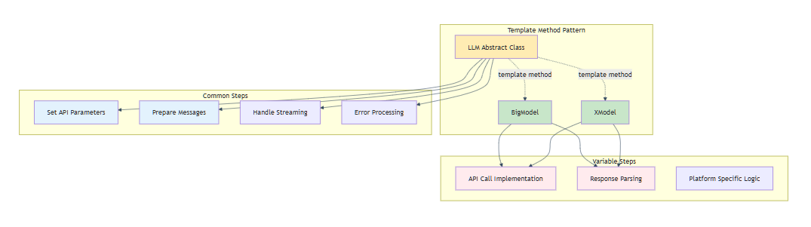

```java
抽象模板类 (LLM.java):
public abstract class LLM {
    // 通用属性和方法
    private String APIKey;
    private String APIUrl;
    private String model;
    protected ArrayList<POSTMessage> messagesArray;

    // 构造函数定义通用初始化流程
    public LLM(String APIKey, String APIUrl, String model) {
        this.APIKey = APIKey;
        this.APIUrl = APIUrl;
        this.model = model;
        this.messagesArray = new ArrayList<>();
    }

    // 抽象方法，子类必须实现
    public abstract void callLLM(String prompt, String content, StreamCallback callback);
}
```

#### ✅ 优势

* **代码复用** ：通用的初始化逻辑和属性管理在基类中实现
* **一致性** ：确保所有LLM实现都遵循相同的基本结构
* **扩展性** ：新增LLM类型只需继承并实现抽象方法
* **维护性** ：通用功能的修改只需在基类中进行

#### 🔧 特点

* **骨架定义** ：抽象类定义了LLM服务的基本骨架
* **钩子方法** ：callLLM方法作为钩子方法由子类实现
* **不变部分** ：公共属性和getter/setter方法保持不变
* **可变部分** ：具体的API调用逻辑由子类定制

#### 🎯 解决的问题

* **代码重复** ：避免在每个LLM实现中重复相同的基础代码
* **结构不一致** ：统一不同LLM实现的基本结构
* **维护困难** ：集中管理通用功能，便于维护和升级
* **扩展复杂** ：简化新LLM类型的接入过程

## 观察者模式(Observer Pattern)

通过StreamCallback接口实现观察者模式，处理LLM API的流式响应，实现实时数据推送：

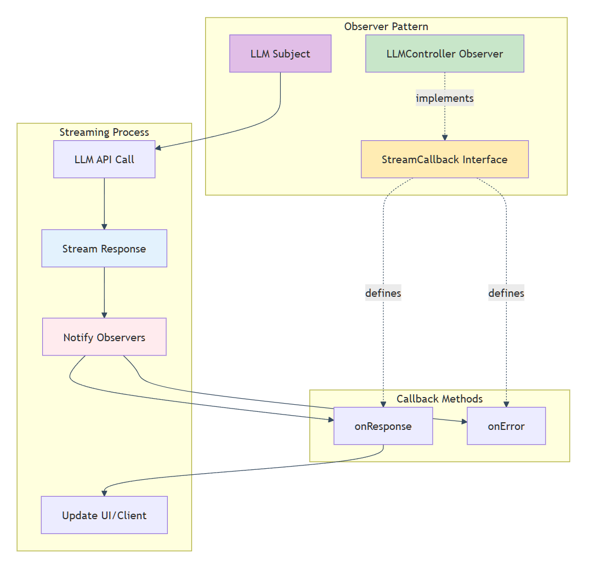

```java
观察者接口 (StreamCallback.java):
public interface StreamCallback {
    /**
     * 处理流式输出的回调方法
     */
    void onResponse(String chunk, boolean isDone);

    /**
     * 错误处理回调方法
     */
    void onError(String error);
}

观察者实现 (LLMController.java):
StreamCallback callback = new StreamCallback() {
    @Override
    public void onResponse(String chunk, boolean isDone) {
        responseText.append(chunk);
        // 实时处理流式数据
    }

    @Override
    public void onError(String error) {
        logger.error("获取建议时发生错误: " + error);
    }
};
```

#### ✅ 优势

* **实时响应** ：支持流式数据的实时处理和推送
* **松耦合** ：LLM服务和响应处理逻辑完全解耦
* **异步处理** ：支持异步的数据流处理
* **错误处理** ：统一的错误通知机制
* **扩展性** ：可以轻松添加多个观察者处理不同类型的响应

#### 🔧 特点

* **事件驱动** ：基于回调的事件驱动架构
* **状态通知** ：通过isDone参数通知流处理状态
* **错误传播** ：统一的错误传播机制
* **接口约定** ：通过接口定义标准的通知协议

#### 🎯 解决的问题

* **阻塞等待** ：避免同步等待长时间的AI响应
* **用户体验** ：提供流式响应改善用户体验
* **资源占用** ：减少长连接的资源占用
* **响应处理** ：灵活处理不同类型的响应数据

## 单例模式(Singleton Pattern)

虽然项目中没有显式的单例类，但Spring框架的Bean管理实际上实现了单例模式。ConfigService、BlogFileService等服务类都是单例Bean：

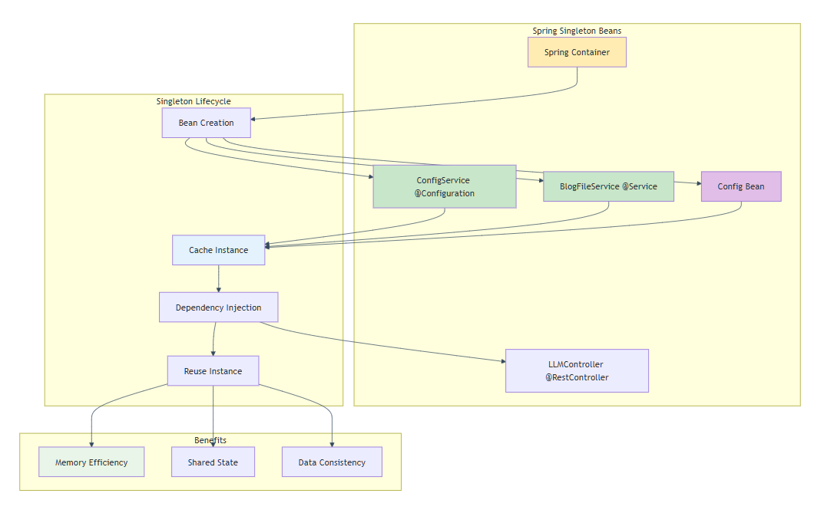

```java
Spring管理的单例Bean (ConfigService.java):
@Configuration
public class ConfigService {
    // Spring确保这个类只有一个实例
    private Path configPath;
    private Config config;

    @PostConstruct
    public void loadConfig() {
        // 初始化配置，全局共享
    }
}

服务层单例 (BlogFileService.java):
@Service
public class BlogFileService {
    // Spring容器管理的单例服务
    private final Path storageLocation;
    private Config config;

    @Autowired
    public BlogFileService(Config config) {
        // 依赖注入单例配置
    }
}
```

#### ✅ 优势

* **内存效率** ：减少对象创建，节省内存资源
* **全局访问** ：提供全局唯一的配置和服务实例
* **状态共享** ：在整个应用中共享配置和状态信息
* **生命周期管理** ：Spring容器自动管理Bean的生命周期
* **线程安全** ：Spring确保Bean创建过程的线程安全

#### 🔧 特点

* **容器管理** ：由Spring IoC容器负责单例管理
* **懒加载** ：支持懒加载和提前初始化
* **依赖注入** ：通过@Autowired实现依赖注入
* **配置驱动** ：通过注解配置单例行为

#### 🎯 解决的问题

* **资源浪费** ：避免重复创建相同的服务实例
* **配置管理** ：全局统一的配置管理
* **状态一致性** ：确保应用状态的一致性
* **初始化开销** ：减少重复的初始化开销

## 策略模式(Strategy Pattern)

LLMController中根据用户选择动态切换不同的LLM服务提供商，体现了策略模式的应用：

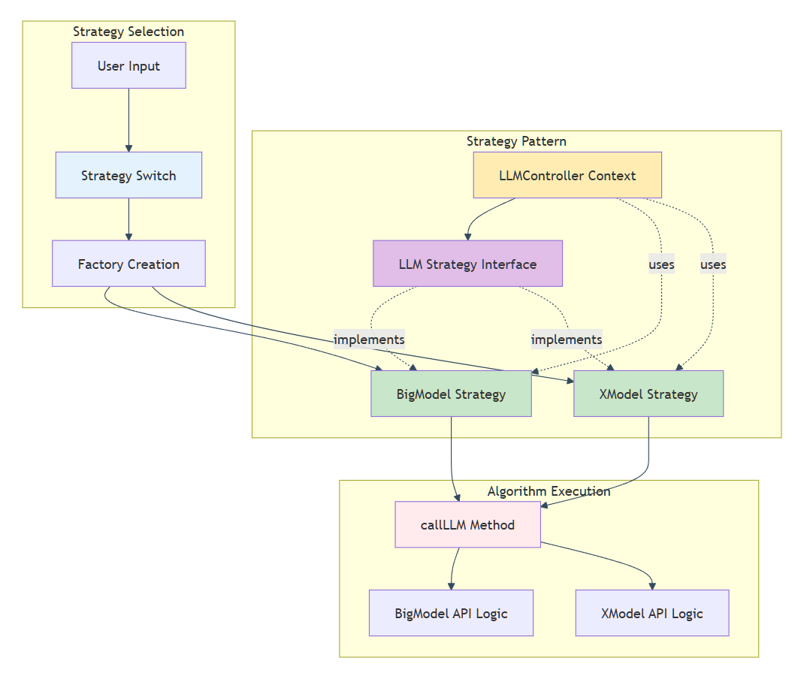

```java
策略上下文 (LLMController.java):
@RestController
public class LLMController {
    private LLM llm; // 策略接口引用

    @RequestMapping("/set")
    public void getLlm(@RequestParam String llmType) {
        switch (llmType) {
            case "XModel":
                XModelFactory factory = new XModelFactory(config);
                llm = factory.createLLM(); // 动态策略选择
                break;
            case "BigModel":
                BigModelFactory bigModelFactory = new BigModelFactory(config);
                llm = bigModelFactory.createLLM();
                break;
        }
    }

    // 使用选定的策略
    public void processRequest() {
        llm.callLLM(prompt, content, callback);
    }
}
```

#### ✅ 优势

* **运行时切换** ：可以在运行时动态切换不同的AI服务提供商
* **算法独立** ：不同LLM的实现算法完全独立
* **易于扩展** ：添加新的LLM类型不需要修改现有代码
* **消除条件语句** ：避免大量的if-else或switch语句
* **测试友好** ：可以轻松测试不同的策略实现

#### 🔧 特点

* **策略封装** ：每个LLM实现都封装了特定的调用策略
* **上下文无关** ：策略实现不依赖特定的上下文
* **工厂结合** ：与工厂模式结合创建策略实例
* **配置驱动** ：基于用户配置选择合适的策略

#### 🎯 解决的问题

* **硬编码算法** ：避免将具体的LLM调用逻辑硬编码
* **服务商锁定** ：避免被单一AI服务提供商锁定
* **算法切换** ：简化不同AI服务之间的切换
* **代码膨胀** ：避免因多种算法导致的代码膨胀

# 设计思想总结

## 单一职责原则(SRP)

每**一个类应该只有一个引起它变化的原因** ，即一个类只应该有一个职责。每个类都应该专注于做好一件事情。

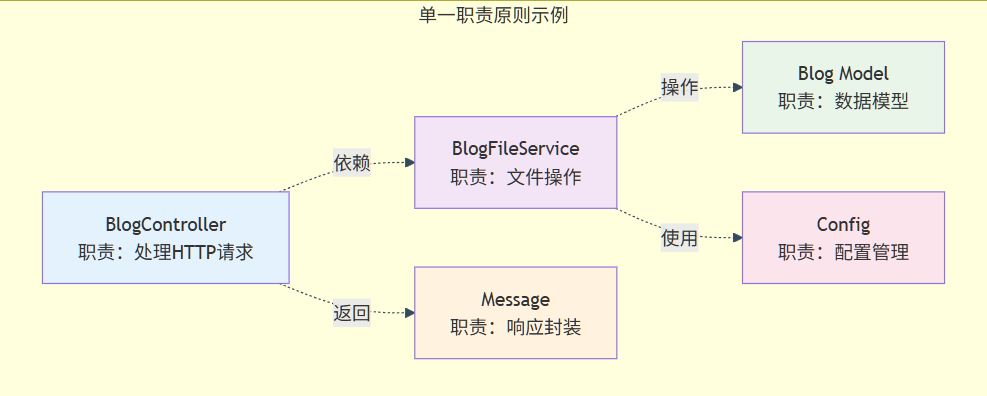

良好示例：

> BlogController - 专注于HTTP请求处理

```java
@RestController
@RequestMapping("/api/blogs")
public class BlogController {
    // 单一职责：仅处理HTTP请求和响应
    @GetMapping
    public ResponseEntity<List<Blog>> getAllBlogs() { ... }
  
    @PostMapping
    public ResponseEntity<Blog> createBlog(@RequestBody Blog blog) { ... }
  
    @DeleteMapping("/{filename}")
    public ResponseEntity<String> deleteBlog(@PathVariable String filename) { ... }
}
```

ConfigService - 专注于配置管理

```java
@Configuration
public class ConfigService {
    // 单一职责：应用程序配置的加载、验证和管理
    @PostConstruct
    public void loadConfig() { ... }
  
    public Config getConfig() { return config; }
  
    public void saveConfig(Config config) throws IOException { ... }
  
    private void validateConfig(Config config) { ... }
}
```

#### ✅ SRP在项目中的优势体现

* **高内聚** ：每个类的功能高度集中，如BlogController只处理Web层逻辑
* **易维护** ：修改文件操作逻辑只需改BlogFileService，不影响Controller
* **可测试** ：每个类都可以独立进行单元测试
* **职责明确** ：开发者可以快速定位功能模块

## 开闭原则(OCP)

**软件实体应该对扩展开放，对修改封闭** 。即在不修改现有代码的前提下，通过扩展来实现新功能。

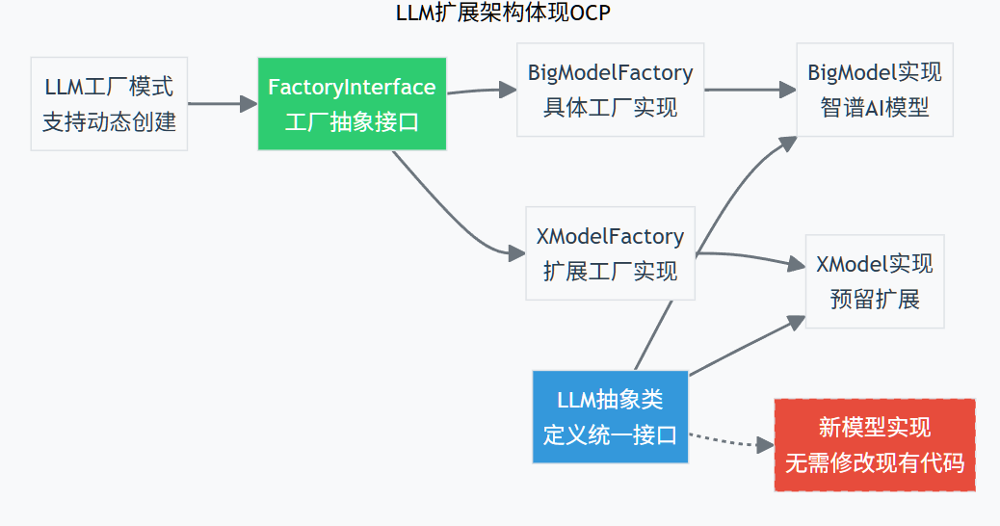

### 实现示例

> LLM抽象基类 - 对扩展开放

```java
public abstract class LLM {
    protected String APIKey;
    protected String APIUrl;
    protected String model;
    protected ArrayList<POSTMessage> messagesArray;
  
    public LLM(String APIKey, String APIUrl, String model) {
        // 基础功能实现
    }
  
    // 抽象方法：对扩展开放
    public abstract void callLLM(String prompt, String content, StreamCallback callback);
  
    // 通用方法：对修改封闭
    public String getAPIKey() { return APIKey; }
    public void setAPIKey(String APIKey) { this.APIKey = APIKey; }
}
```

> BigModel具体实现-扩展而非修改

```java
public class BigModel extends LLM {
    private static final Logger logger = LoggerFactory.getLogger(BigModel.class);
  
    public BigModel(String APIKey, String APIUrl, String model) {
        super(APIKey, APIUrl, model);  // 复用基类功能
    }
  
    @Override
    public void callLLM(String prompt, String content, StreamCallback callback) {
        // 智谱AI特定的实现逻辑
        // 无需修改LLM基类
        try {
            POSTMessage message = new POSTMessage("user", prompt + content);
            // ... 具体实现
        } catch (Exception e) {
            callback.onError("调用LLM时发生错误: " + e.getMessage());
        }
    }
}
```

> 工厂模式支持-扩展新模型

```java
public interface FactoryInterface {
    LLM createLLM(String APIKey, String APIUrl, String model);
}

public class BigModelFactory implements FactoryInterface {
    @Override
    public LLM createLLM(String APIKey, String APIUrl, String model) {
        return new BigModel(APIKey, APIUrl, model);
    }
}

// 新增模型时，只需添加新的工厂实现，无需修改现有代码
public class NewAIModelFactory implements FactoryInterface {
    @Override
    public LLM createLLM(String APIKey, String APIUrl, String model) {
        return new NewAIModel(APIKey, APIUrl, model);
    }
}
```

#### OCP在项目中的优势体现

* **扩展性强** ：新增AI模型无需修改现有LLM代码
* **稳定性好** ：现有功能不受新功能影响
* **维护简单** ：新功能独立开发和测试
* **向后兼容** ：系统升级不破坏现有功能

## 里氏替换原则 (Liskov Substitution Principle, LSP)

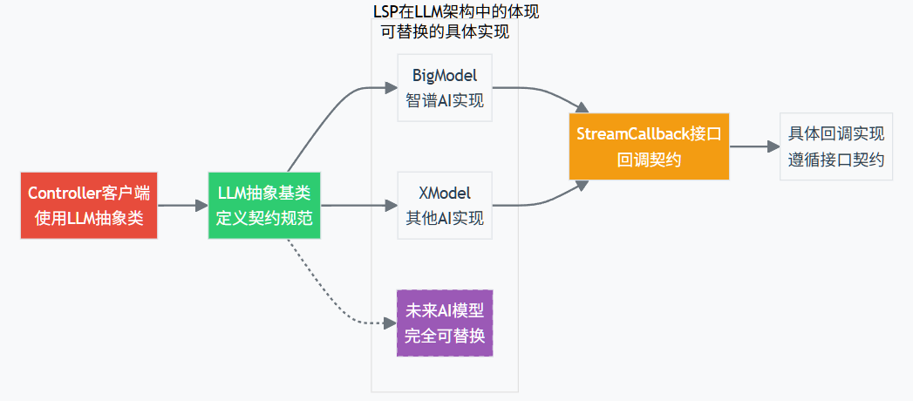

> StreamCallback接口契约

```java
jpublic interface StreamCallback {
    /**
     * 处理流式输出的回调方法
     * 契约：chunk不为null，isDone表示是否完成
     */
    void onResponse(String chunk, boolean isDone);
  
    /**
     * 错误处理回调方法
     * 契约：error不为null且包含错误描述
     */
    void onError(String error);
}

// 在Controller中的使用 - 完全可替换
public void processLLMRequest(LLM llmInstance) {
    // 无论传入BigModel还是XModel，都能正常工作
    llmInstance.callLLM(prompt, content, new StreamCallback() {
        @Override
        public void onResponse(String chunk, boolean isDone) {
            // 处理响应
        }
  
        @Override
        public void onError(String error) {
            // 处理错误
        }
    });
}
```

#### LSP在项目中的优势体现

* **完全可替换** ：BigModel和XModel在客户端代码中完全可互换
* **行为一致性** ：所有LLM实现都遵循相同的调用契约
* **多态支持** ：支持运行时动态选择不同的AI模型
* **测试友好** ：可以用Mock对象替换真实实现进行测试

## 接口隔离原则

**不应该强迫客户端依赖它们不使用的接口** 。应该使用多个专门的接口，而不是单一的总接口。

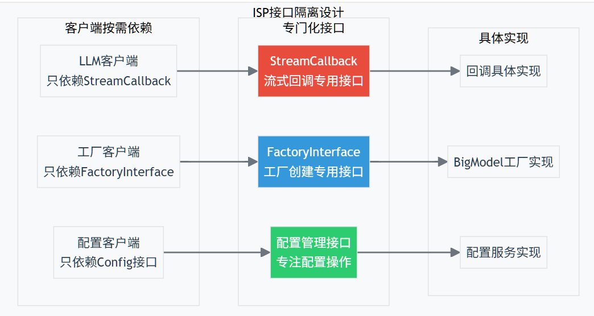

#### ✅ ISP在项目中的优势体现

* **最小依赖** ：每个客户端只依赖它真正需要的接口方法
* **高度聚焦** ：接口职责单一，易于理解和实现
* **变更隔离** ：某个接口的变更不会影响其他无关客户端
* **实现简单** ：实现类无需提供无关功能的空实现

# 系统流程图

## 用户认证流程图

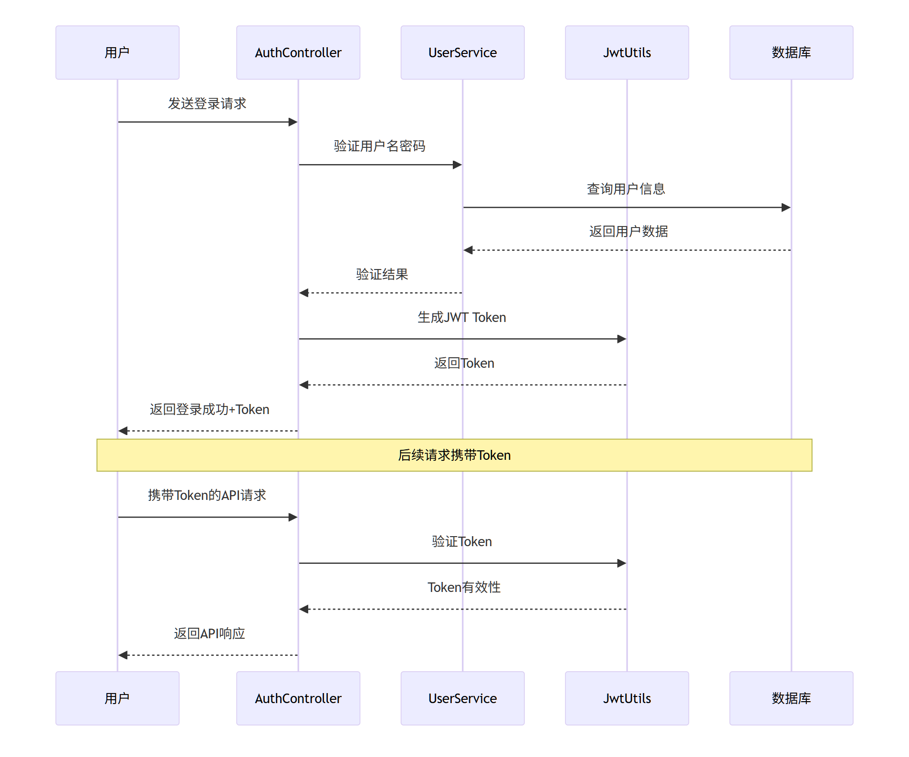

## 博客文章管理流程图


## LLM集成流程图

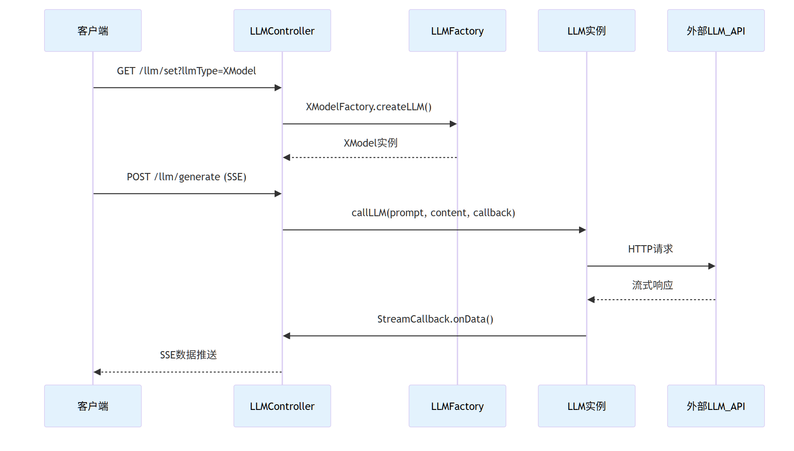

## 数据库设计

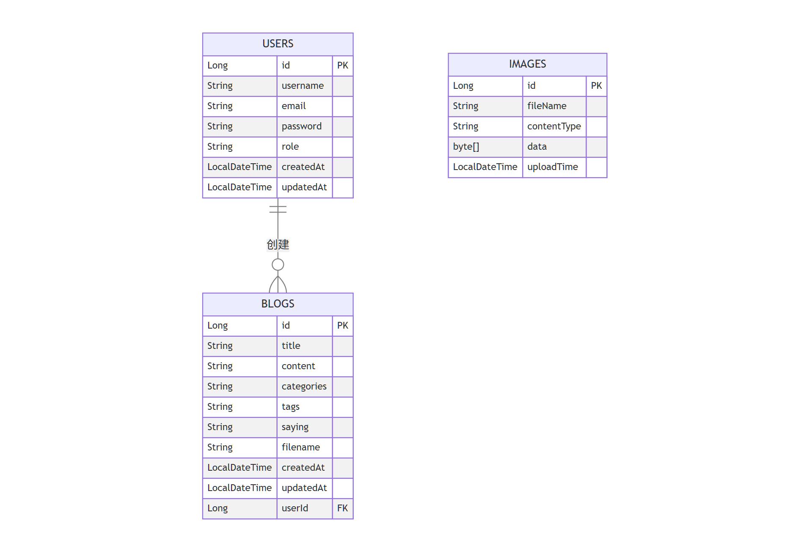
