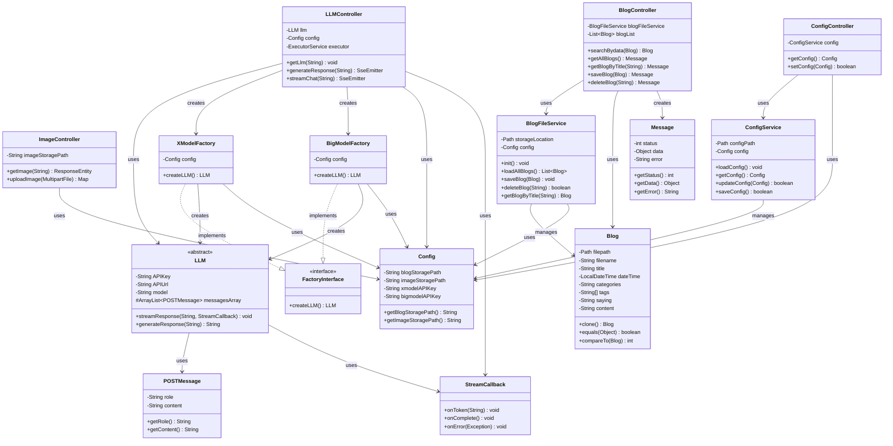

# 博客管理系统 - 项目层次结构图

## 系统整体层次结构


## 详细层次依赖关系图



## 各层职责说明

### 控制器层 (Controller Layer)

- **BlogController**: 处理博客相关的HTTP请求，包括博客的增删改查
- **LLMController**: 处理大语言模型相关请求，包括流式对话和响应生成
- **ConfigController**: 处理系统配置的获取和更新
- **ImageController**: 处理图片上传和访问请求

### 服务层 (Service Layer)

- **BlogFileService**: 博客文件的业务逻辑处理，包括文件读写、博客解析等
- **ConfigService**: 系统配置的业务逻辑，配置文件的加载和保存
- **LLM相关服务**: 大语言模型的抽象和具体实现，使用工厂模式创建不同的LLM实例

### 数据访问层 (Repository Layer)

- 在本项目中，BlogFileService和ConfigService同时承担了数据访问的职责
- 直接与文件系统交互，进行数据持久化

### 实体层 (Model Layer)

- **Blog**: 博客实体，包含博客的所有属性和元数据
- **Message**: 统一的响应消息格式
- **Config**: 系统配置实体
- **POSTMessage**: LLM交互的消息实体

## 设计模式应用

1. **工厂模式**: XModelFactory和BigModelFactory实现FactoryInterface，用于创建不同类型的LLM实例
2. **依赖注入**: 使用Spring的@Autowired注解实现依赖注入
3. **模板方法模式**: LLM抽象类定义了通用的方法结构
4. **回调模式**: StreamCallback用于处理流式响应

## 分层详细结构图

### 1. 控制器层 (Controller Layer) 结构图


### 2. 服务层 (Service Layer) 结构图


### 3. 数据访问层 (Repository Layer) 结构图

```mermaid
graph TB
    subgraph "数据访问层 (Repository Layer)"
        BFS_REPO[BlogFileService<br/>博客数据访问]
        CS_REPO[ConfigService<br/>配置数据访问]
    end
    
    subgraph "数据存储"
        MD_FILES[Markdown文件<br/>(.md)]
        JSON_CONFIG[配置文件<br/>(config.json)]
        IMAGE_FILES[图片文件<br/>(.jpg/.png)]
    end
    
    subgraph "文件操作"
        READ[文件读取]
        WRITE[文件写入]
        DELETE[文件删除]
        CREATE[文件创建]
        LIST[文件列表]
    end
    
    subgraph "数据操作方法"
        BLOG_OPS["• 读取博客目录<br/>• 解析Markdown<br/>• 提取元数据<br/>• 保存博客文件<br/>• 删除博客文件"]
        CONFIG_OPS["• 读取JSON配置<br/>• 解析配置对象<br/>• 保存配置文件<br/>• 验证配置格式"]
    end
    
    BFS_REPO --> BLOG_OPS
    CS_REPO --> CONFIG_OPS
    
    BFS_REPO --> MD_FILES
    BFS_REPO --> IMAGE_FILES
    CS_REPO --> JSON_CONFIG
    
    BLOG_OPS --> READ
    BLOG_OPS --> WRITE
    BLOG_OPS --> DELETE
    BLOG_OPS --> LIST
    
    CONFIG_OPS --> READ
    CONFIG_OPS --> WRITE
    CONFIG_OPS --> CREATE
    
    style BFS_REPO fill:#e1f5fe
    style CS_REPO fill:#e1f5fe
    style MD_FILES fill:#fff3e0
    style JSON_CONFIG fill:#fff3e0
    style IMAGE_FILES fill:#fff3e0
```

### 4. 实体层 (Model Layer) 结构图


### 5. 层间交互流程图


## 架构特点总结

### 优势
1. **分层清晰**: 每层职责明确，依赖关系单向
2. **可扩展性**: 使用工厂模式，便于扩展新的LLM实现
3. **松耦合**: 通过接口和抽象类降低耦合度
4. **可测试性**: 各层独立，便于单元测试

### 改进建议
1. **引入真正的Repository层**: 将数据访问逻辑从Service中分离
2. **添加DTO层**: 在Controller和Service之间使用数据传输对象
3. **异常处理**: 统一的异常处理机制
4. **缓存机制**: 为频繁访问的数据添加缓存层
