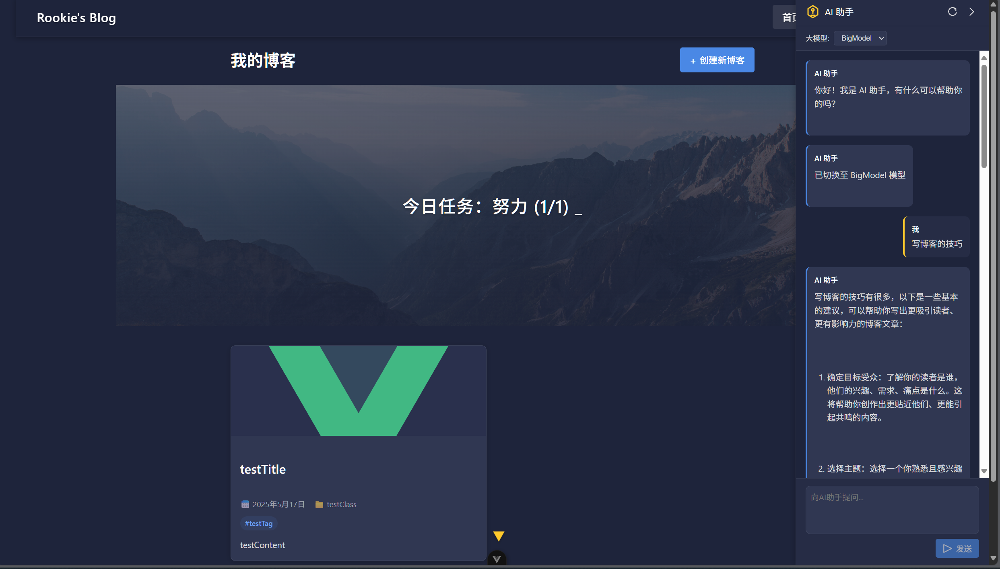
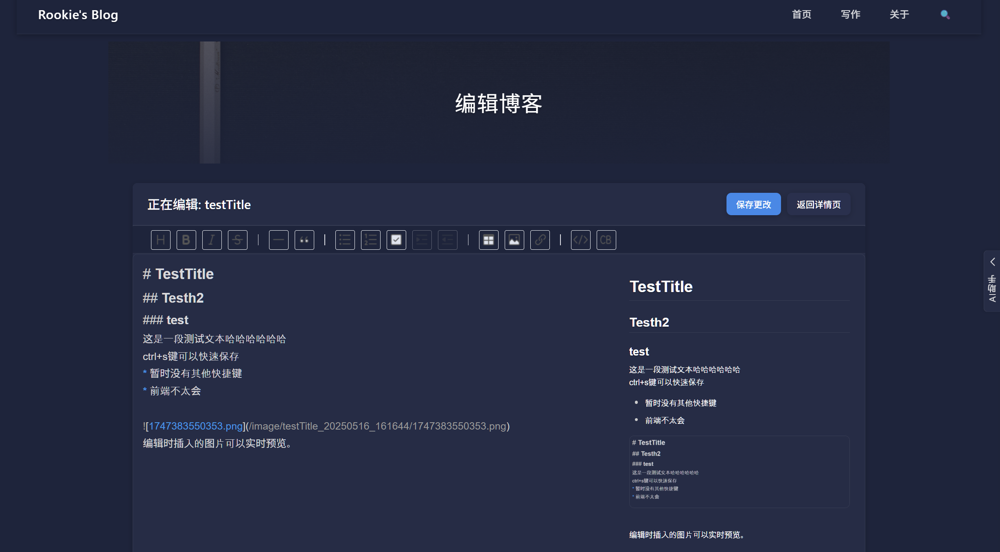
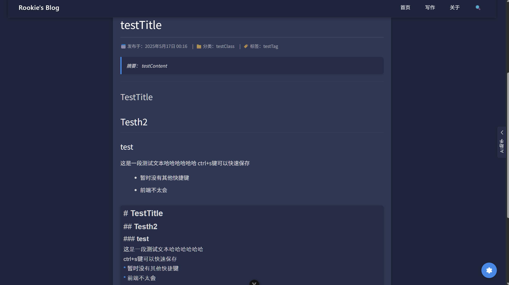
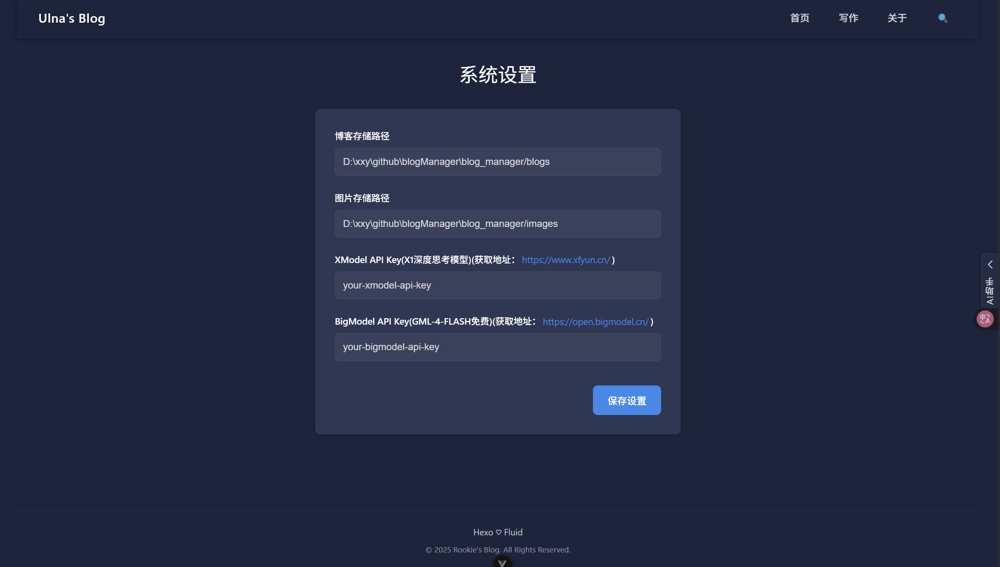

<div align=center>
<h1>📝 Blog 管理系统</h1>
</div>

## 📸 运行时截图

主页以及ai侧边栏：



编辑blog：



阅读模式：



## 🚀 本地部署教程

### 1.  克隆仓库到本地 📥

Http链接：

```url
https://github.com/xxy1103/blogManager.git
```

SSH链接：

```url
git@github.com:xxy1103/blogManager.git
```

使用指令：

```bash
git clone git@github.com:xxy1103/blogManager.git
```

或者通过GitHub，将项目打包下载并解压。

### 2.启动后端 ⚙️

进入 `blogManager/blog_manager`路径，打开控制台输入：

```bash
mvn clean install
```

然后输入：

```java
java -jar target/blog_manager-0.0.1-SNAPSHOT.jar
```

### 3. 启动前端 🖥️

进入路径：`blogManager/Vue/blog_manager`路径，打开控制台输入：

```bash
npm install
```

再次输入：

```bash
npm run dev
```

最后访问输出的链接即可。 🎉

### 🛠️ 参数配置



首次运行时，会自动以当前的工作目录作为默认配置，如需修改可以在系统设置中进行修改。

* XModel为讯飞开发平台的x1模型。
* BigModel 使用智谱青言的完全免费大模型GML-4-Flash

**⚠️ 每次系统启动后，需要先选择使用的大模型。**

作者邮箱：`xianxingyuan520@outlook.com`
