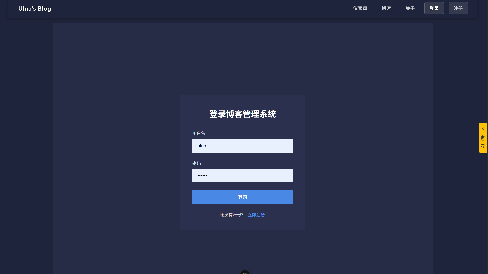
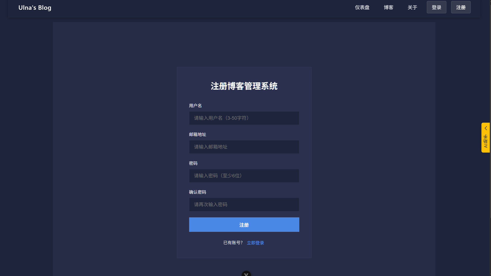
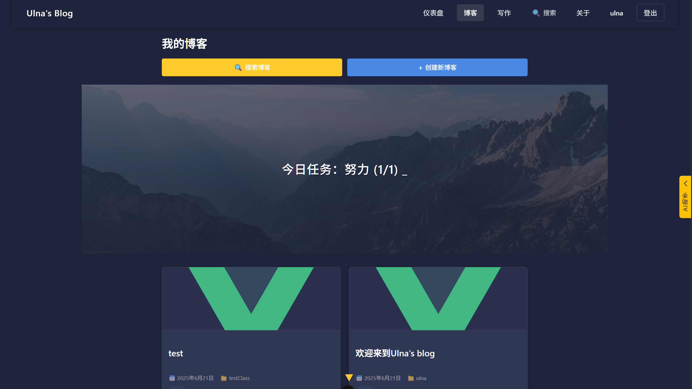
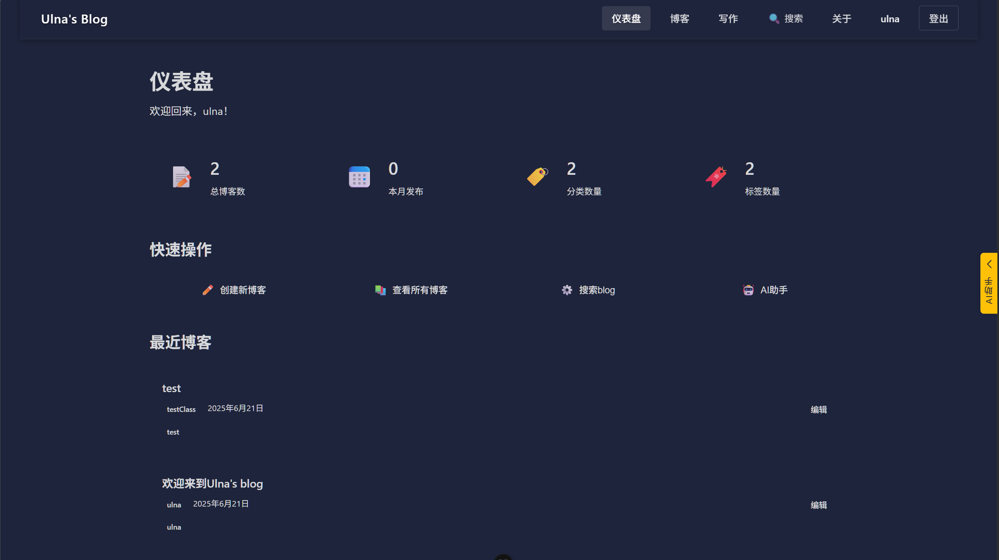
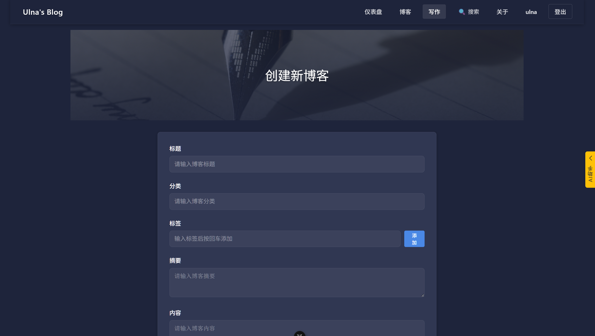
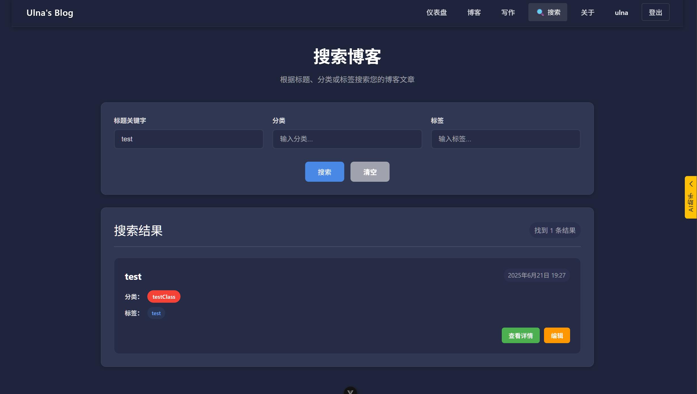
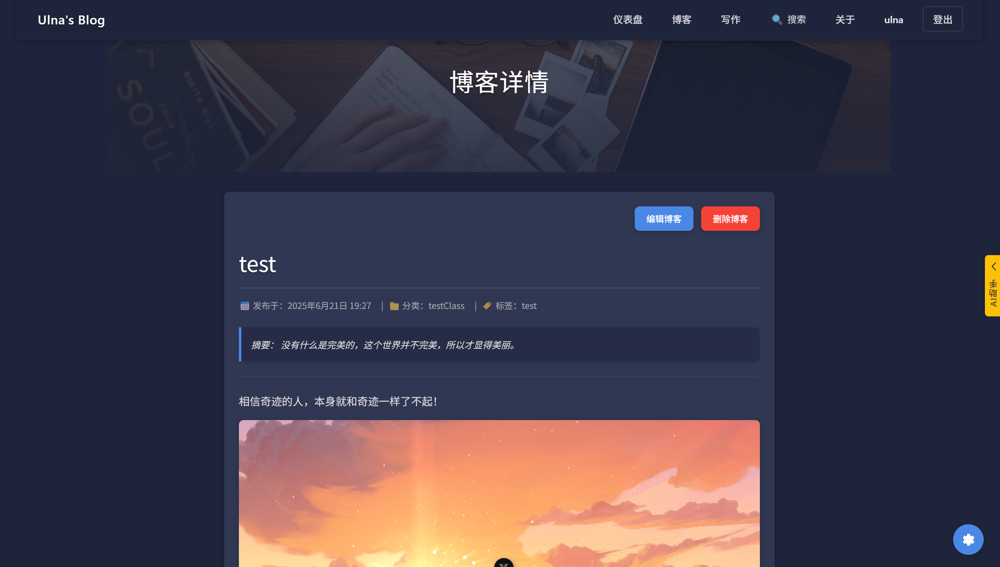
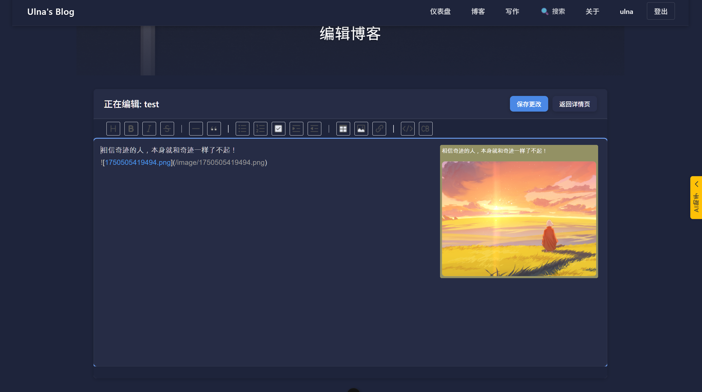
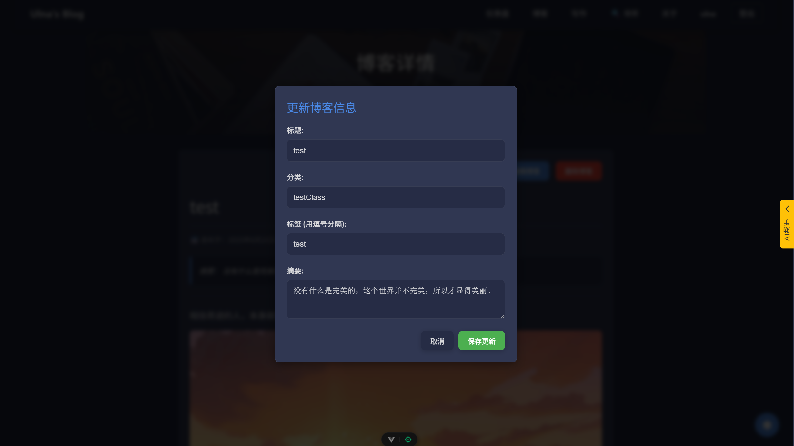
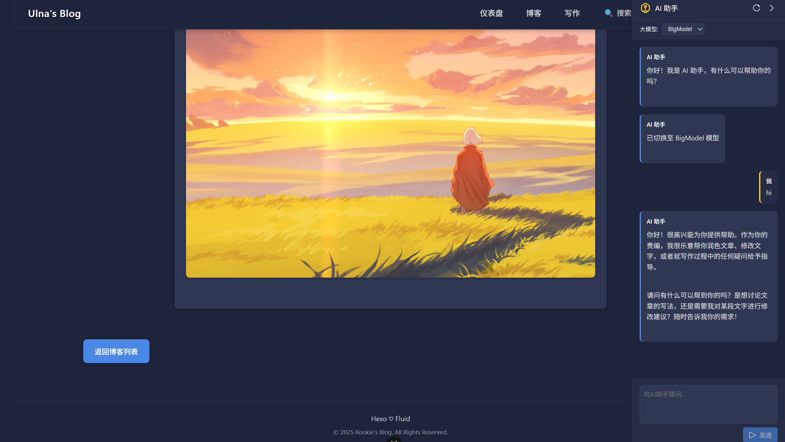

<div align="center">
  <h1>📝 Blog 管理系统</h1>
  <p><em>基于 Spring Boot + Vue 3 的现代化博客管理平台</em></p>

  
  
  
  

</div>

## 📋 目录

- [项目简介](#-项目简介)
- [技术栈](#-技术栈)
- [功能特性](#-功能特性)
- [快速开始](#-快速开始)
- [系统截图](#-系统截图)
- [API文档](#-api文档)
- [项目结构](#-项目结构)
- [部署说明](#-部署说明)
- [贡献指南](#-贡献指南)
- [联系方式](#-联系方式)

## 🚀 项目简介

Blog 管理系统是一个功能完整的现代化博客管理平台，支持博客创建、编辑、分类管理、标签系统、图片上传以及AI智能助手等功能。系统采用前后端分离架构，提供良好的用户体验和开发体验。

## 🛠 技术栈

### 后端技术

- **Spring Boot 3.4.5** - 主框架
- **Spring Security** - 安全认证
- **Spring Data JPA** - 数据持久化
- **MySQL 8.0** - 数据库
- **Maven** - 依赖管理

### 前端技术

- **Vue 3.5.13** - 前端框架
- **TypeScript** - 类型安全
- **Vite** - 构建工具
- **Vue Router** - 路由管理
- **Pinia** - 状态管理
- **Toast UI Editor** - 富文本编辑器
- **Axios** - HTTP客户端

## ✨ 功能特性

- 🔐 **用户认证** - 注册、登录、权限管理
- 📝 **博客管理** - 创建、编辑、删除、分类
- 🏷️ **标签系统** - 多标签支持，灵活分类
- 🔍 **智能搜索** - 关键字、分类、标签多维度搜索
- 🖼️ **图片管理** - 拖拽上传，实时预览
- 📊 **数据统计** - 博客统计、用户仪表盘
- 🤖 **AI助手** - 智能写作辅助
- 📱 **响应式设计** - 适配多种设备
- ⌨️ **快捷键支持** - Ctrl+S 快速保存
- 🌙 **实时预览** - Markdown 实时渲染

## 🚀 快速开始

### 环境要求

- Java 17+
- Node.js 18+
- MySQL 8.0+
- Maven 3.8+

### ⚡ 快速启动

1. **克隆项目**

```bash
git clone git@github.com:xxy1103/blogManager.git
cd blogManager
```

2. **数据库配置**

```bash
# 执行数据库脚本
mysql -u root -p < blog_manager/database_setup.sql

# 修改数据库配置
# 编辑 blog_manager/src/main/resources/application.properties
```

3. **启动后端服务**

```bash
cd blog_manager
mvn spring-boot:run
```

4. **启动前端服务**

```bash
cd Vue/blog_manager
npm install
npm run dev
```

5. **访问应用**

- 前端地址: http://localhost:5173
- 后端地址: http://localhost:5200
- 默认账户: admin / admin123

### 📖 详细部署文档

如需了解完整的部署配置、生产环境部署、Docker部署等详细信息，请参考：

👉 **[完整部署文档](项目部署文档.md)**

该文档包含：

- 🔧 详细的环境配置说明
- 🗄️ 数据库设置步骤
- ⚙️ 配置文件说明
- 🚀 生产环境部署指南
- 🐳 Docker部署方案
- ❗ 常见问题解决方案

## 📸 系统截图

### 🔐 用户认证

**登录页面**



- 安全的用户登录界面
- 支持用户名/密码认证
- 新用户注册引导

**注册页面**



- 简洁的用户注册流程
- 用户名、邮箱、密码验证
- 实时输入验证

### 📝 博客管理

**博客列表**



- 展示用户的所有博客文章
- 支持分页浏览
- 快速操作功能

**用户仪表盘**



- 📊 博客统计信息展示
- 📈 本月发布数据
- 🏷️ 分类和标签统计
- ⚡ 快捷操作入口

**创建博客**



- ✏️ 标题、分类、摘要编辑
- 🏷️ 多标签支持（点击添加生效）
- 📝 富文本内容编辑
- 💾 自动保存草稿

### 🔍 搜索功能



- 🔍 关键字全文搜索
- 📂 分类筛选
- 🏷️ 标签过滤
- ⚡ 实时搜索结果

### 📖 博客阅读

**详情页面**



- 📖 优雅的阅读体验
- 🎨 Markdown 渲染
- ✏️ 快速编辑入口（右下角）

**在线编辑**



- 📝 左侧 Markdown 编辑器
- 👁️ 右侧实时预览
- 🖼️ **特色功能**：
  - 直接粘贴图片自动上传
  - 实时预览图片显示
  - `Ctrl+S` 快捷保存

**信息编辑**



- ✏️ 博客基础信息修改
- 🏷️ 分类和标签管理
- 📝 摘要和标题更新

### 🤖 AI 智能助手



- 🤖 多模型选择支持
- 💬 实时对话交流
- ✍️ 博客写作辅助
- 💡 创意灵感提供

## 📁 项目结构

```
blogManager/
├── blog_manager/           # Spring Boot 后端
│   ├── src/
│   │   ├── main/java/     # Java 源码
│   │   └── resources/     # 配置文件
│   ├── database_setup.sql # 数据库脚本
│   └── pom.xml           # Maven 配置
├── Vue/blog_manager/      # Vue 3 前端
│   ├── src/
│   │   ├── components/   # 组件
│   │   ├── views/        # 页面
│   │   ├── services/     # 服务层
│   │   └── stores/       # 状态管理
│   └── package.json      # NPM 配置
└── image/                # 静态资源
```

## 🤝 贡献指南

欢迎提交 Issue 和 Pull Request！

1. Fork 本仓库
2. 创建特性分支 (`git checkout -b feature/AmazingFeature`)
3. 提交更改 (`git commit -m 'Add some AmazingFeature'`)
4. 推送到分支 (`git push origin feature/AmazingFeature`)
5. 开启 Pull Request

## 📄 许可证

本项目采用 MIT 许可证，详情请查看 [LICENSE](LICENSE) 文件。

## 📞 联系方式

- 📧 邮箱：`xianxingyuan520@outlook.com`
- 🐛 问题反馈：[Issues](../../issues)
- 💡 功能建议：[Discussions](../../discussions)

---

<div align="center">
  <p>⭐ 如果这个项目对您有帮助，请给它一个星标！</p>
  <p>Made with ❤️ by the Blog Manager Team</p>
</div>
